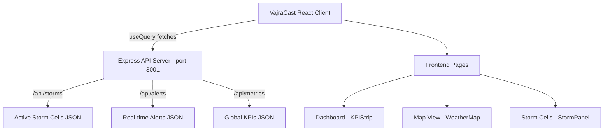

# VajraCast Architecture & Wireframe Blueprint

This document outlines the complete architectural design, data flows, and wireframe breakdown of the **VajraCast** project. The application features a fully working React frontend connected to an Express backend.

## 1. System Architecture

The project follows a standard **Client-Server Architecture**:

- **Frontend (Client)**: React (Vite) + Tailwind CSS + MapLibre GL
- **Backend (API)**: Express.js + Node.js
- **Data Communication**: RESTful JSON API using `@tanstack/react-query`

## 2. Wireframes & Page Workflows

### 2.1 The Global Shell (Sidebar & TopBar)
- **Sidebar**: Sticky on the left. Contains navigation buttons (`Dashboard`, `Map`, `Analytics`, `Storms`, `AI Assistant`, `Alerts`, `Reports`, `Settings`). All buttons use the custom sage green accent (`bg-[#9cb5ab]`).
- **TopBar**: Context-aware header that displays the active page name (e.g., `VajraCast / Analytics`).

### 2.2 Dashboard (Nowcast & Overview)
- **KPI Strip**: Fetches `/api/metrics` via `useMetrics()`. Displays top-level stats (Active Storms, Thunderstorm/Lightning probabilities).
- **Map View (`WeatherMap.tsx`)**: Integrates MapLibre GL. Fetches `/api/storms` via `useStorms()`. Maps the coordinates of severe weather systems to the map layer. Clicking a storm cluster opens the `StormPanel`.
- **Storm Panel**: A glassmorphic overlay fetching specific storm details and rendering a Recharts component for intensity trend analysis.

### 2.3 Storm Cells Page
- Displays a vertical scrollable list of active convective cells.
- The UI filters storms by Risk Level (`HIGH RISK`, `INTENSIFYING`).
- Integrates a radar view showing the selected storm cell. The color scheme focuses on **Red** for severe intensity indicators (previously yellow/amber).

### 2.4 Analytics Page
- Renders advanced meteorological graphs (e.g., "Forecast vs Observed").
- Includes data widgets for `Model Confidence`, `Storm Detection`, and `Alert Precision`.
- Red gradient highlights areas of intense storm probability over a diurnal cycle.

### 2.5 AI Report Page
- Generates dynamic, AI-assisted summaries of upcoming weather patterns for a specific location.
- Provides a detailed 0-6 hours risk timeline, mapping probabilities and expected rainfall.
- Lists `Affected Things` (Travel, Power) and `Preventive Measures` styled with custom icons and badges.

## 3. Backend Implementation

The backend (`backend/server.js`) operates independently to serve meteorological data. It currently provides three essential endpoints:

| Endpoint | Method | Purpose | Response Format |
|---|---|---|---|
| `/api/storms` | GET | Delivers active storm tracks | `[{id, location, coordinates, intensity, ...}]` |
| `/api/alerts` | GET | Delivers live warning alerts | `[{id, time, location, type, risk}]` |
| `/api/metrics` | GET | Delivers aggregate dashboard stats| `{activeStorms, thunderstormProbability, ...}` |

To run the full stack:
1. **Frontend**: `npm run dev` (Runs on `localhost:5173`)
2. **Backend**: `cd backend && node server.js` (Runs on `localhost:3001`)

## 4. Design System

- **Glassmorphism**: Core UI panels use `bg-white/20 backdrop-blur-xl`.
- **Primary Accent**: Custom Sage Green (`#9cb5ab`). Applied uniformly across all action buttons in the UI for strong thematic consistency.
- **Alert Colors**:
  - Moderate/Stable: Slate/Grey
  - High Risk/Severe: Red (`bg-red-500`)
